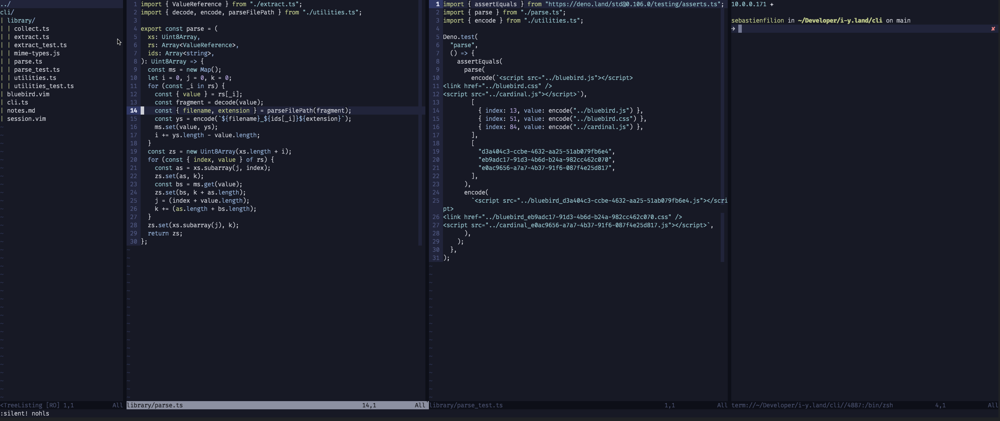

# NVIM

Hello peeps. This is a repository that I use to manage my NVIM configuration.
I don't know why you're looking at this cause I know nothing about VIM or Lua.
I tried to keep it clean and organize, overall trying to keep things grouped by
feature.

My focus is JavaScript/TypeScript through Deno. So I install LSP for Deno,
Rust, HTML & CSS.
 


I vaguely rememember installing a Node module for the debugger to work...
That Debugger does need a bit of polishing, especially around the keybindings.

The module is expected to be found at the root of the configuration directory.

```
npm install vscode-node-debug2
```

If you have any problem with this configuration, do not contact me; I have no
idea what I am doing anyway.
That being said, if you have a fix to suggest, you can make a PR.

